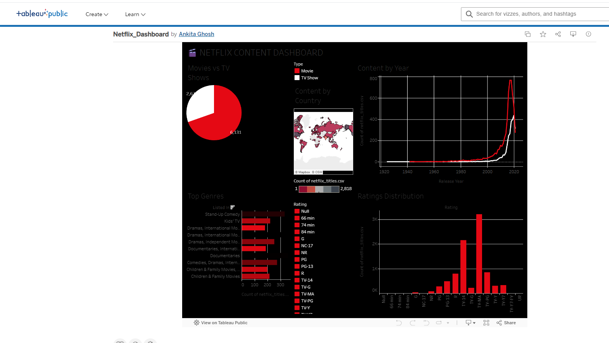

# Netflix-Tableau-Dashboard
🎬 Interactive Netflix Content Dashboard built with Tableau — Movies vs TV Shows, World Map, Top Genres, Ratings Distribution | 8,807 titles analyzed
# 🎬 Netflix Content Dashboard

Built using Tableau Public — analyzing 8,807 Netflix titles.

## 📊 Live Dashboard

## 📸 Preview

## 📁 Files
- `Netflix_Dashboard.twbx` — Tableau workbook
- `netflix_titles.csv` — Dataset from Kaggle
